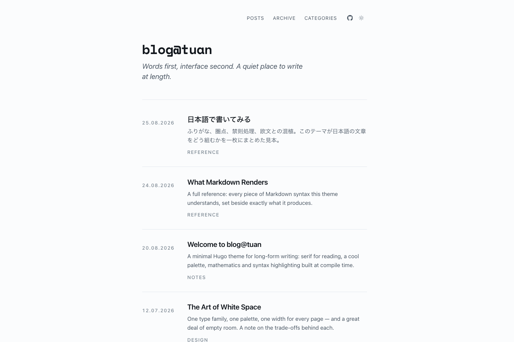

# blog@tuan

A Hugo theme for people who write at length.

One column of text, one serif for reading, one cool grey palette. Mathematics and
syntax highlighting are rendered when the site is built, so the page arrives
finished — nothing repaints, nothing shifts, and turning JavaScript off costs you
three small conveniences rather than the layout.



---

## Features

- **Home, archive, categories, tags** — four views of the same posts, all sharing
  one width so nothing jumps as you move between them.
- **Light and dark** — follows the OS, switches on one button, never flashes.
- **LaTeX** via KaTeX, **syntax highlighting** via Chroma — both at build time.
- **Mermaid** diagrams that take their colours from the theme and redraw when it
  changes.
- **Japanese** with furigana and emphasis dots; **Vietnamese** throughout.
- Reading time, table of contents, copy-code button, RSS, sitemap, Open Graph,
  JSON-LD.

Three type families with one job each: **Georgia** for what you write, the
**system interface font** for what the theme says, **Space Mono** for code. Only
Space Mono is downloaded.

Requires Hugo **0.141.0** or newer. The `extended` build is not needed.

---

## Quick start

```bash
hugo new site blog && cd blog
git init
git submodule add https://github.com/nguyentuan/blog-tuan themes/blog-tuan
```

Then put this in `hugo.toml`:

```toml
theme = "blog-tuan"
title = "Your site"
locale = "en-US"

[params]
  description = "What this site is."
  tagline = "The line under the title on the home page."
  author = "Your name"
```

**One more block is required.** Hugo does not merge a theme's `[markup]`
settings, so copy that section out of
[`exampleSite/hugo.toml`](exampleSite/hugo.toml) into your own file. Without it,
mathematics, Markdown attributes and theme-aware syntax colours stay switched off.

```bash
hugo server
```

---

## Configuration

The theme's own settings live under `[params.blog]`:

```toml
[params]
  [params.blog]
    homeCount = 10
    github = "https://github.com/you"    # adds a GitHub button to the header
    cursorBlink = "vertical"             # a caret after the site name
    dateFormat = "2 January 2006"
```

**[`hugo.toml`](hugo.toml) in the theme root is the full reference.** Every
supported key is there with a note on what it does; the values left uncommented
are the defaults your site inherits. Rather than repeat them here, open that file.

A few things worth knowing before you go looking:

| | |
| --- | --- |
| Custom keys must sit under `[params]` | Hugo discards them anywhere else, silently and with no warning. |
| Dates follow `locale`, not `defaultContentLanguage` | `"2 January 2006"` gives *25 August 2026* for `en-US`, *25 tháng 8 2026* for `vi-VN`. |
| `noClasses = false` is not optional | With `true`, Chroma bakes colours into the markup and syntax stops following the theme. |

### Post URLs

Optional, and plain Hugo:

```toml
[permalinks]
  [permalinks.page]
    posts = "/:year/:month/:contentbasename/"
```

Prefer `:contentbasename` to `:slug`. `:slug` falls back to the title, and titles
that are not plain ASCII do not survive the trip — with `removePathAccents` on,
日本語**で** came out as `/日本語て/`.

---

## Writing

```yaml
---
title: "The title"
date: 2026-08-20
description: "Used for the list summary and the meta tags."
categories: ["Engineering"]
tags: ["hugo"]
toc: true
---
```

`toc` opens by default when the contents list is short and stays folded when it
is long. Add `lang: ja` for a Japanese post. Everything else the theme reads is
listed in [`hugo.toml`](hugo.toml).

### Mathematics

`$...$` inline, `$$...$$` for display. KaTeX runs during the build; its
stylesheet loads only on pages that need it.

```markdown
The Basel problem: $\sum_{n=1}^{\infty} \frac{1}{n^2} = \frac{\pi^2}{6}$
```

Escape a currency `$` as `\$`, and keep a lone `=` off its own line inside a `$$`
block — Markdown reads it as a heading and splits the expression.

### Code

````markdown
```python {title="retry.py",linenos=true,hl_lines=["12-16"]}
```
````

Code sits in the text column. `wide=true` lets a block reach the page frame.

### Diagrams

````markdown

````

Same rules as code, `{wide=true}` included.

### Callouts

```markdown

Ordinary Markdown inside.

```

`note`, `tip`, `warning`, `danger`.

### Other touches

`{.lead}` under a paragraph sets it larger and paler. `{.wide}` on a figure lets
it bleed out of the column. Tables, footnotes, task lists, definition lists,
`==highlight==`, `H~2~O`, `E = mc^2^` and raw HTML all work — the
[Markdown reference post](exampleSite/content/posts/what-markdown-renders/index.md)
in the sample site shows every one of them beside its output.

---

## Japanese

Add `lang: ja` to a post. That single line switches the type stack, opens the
leading, drops the Latin tracking on headings and turns on kinsoku line breaking.
No multilingual site setup needed.

```markdown
という言葉
ここが大事
```

Ruby renders with an `<rp>` fallback and gives its line extra headroom
automatically. Kenten sets emphasis dots above the characters — the Japanese
alternative to bold or italic.

Two site settings matter:

```toml
hasCJKLanguage = true      # count characters, or every post reads as "1 min"

[markup.goldmark.extensions.cjk]
  enable = true
  eastAsianLineBreaks = true
  eastAsianLineBreaksStyle = "simple"
```

Use `simple`. The `css3draft` style also strips spaces from accented Latin at a
soft line break, which quietly damages Vietnamese text.

Vertical writing is not supported.

## Vietnamese

Works as-is; Georgia and the system fonts both cover the diacritics that usually
break. Two settings help:

```toml
removePathAccents = true   # /categories/ky-thuat/ rather than /categories/kỹ-thuật/
titleCaseStyle = "none"    # keep "Ghi chú" as written
```

Interface strings ship in `i18n/` for English, Vietnamese and Japanese. Set
`defaultContentLanguage` and the whole interface follows.

---

## Customising

Colours, sizes and widths are CSS variables in
[`assets/css/01-tokens.css`](assets/css/01-tokens.css). Each is declared twice —
a plain light value, then `light-dark()` — so the dark palette is never a
separate table to maintain.

Create `assets/css/custom.css` in your own site and the theme loads it last:

```css
:root {
  --accent: #0d7490;  --accent: light-dark(#0d7490, #67c9dd);
  --font-prose: "Iowan Old Style", Georgia, serif;   /* article text */
  --font-body: "Inter", system-ui, sans-serif;       /* interface chrome */
  --w-page: 40rem;                                   /* a narrower measure */
}
```

The boundary between the two type families is the `.prose` class: inside it is
what you wrote, outside it is what the theme added.

To replace a template, put a file at the same path in your own site — Hugo
prefers yours over the theme's.

---

## The sample site

Eight posts covering everything above, including a full Markdown reference and a
Japanese page with furigana.

```bash
git clone https://github.com/nguyentuan/blog-tuan
cd blog-tuan/exampleSite
hugo server --themesDir ../..
```

## Licence

MIT — see [LICENSE](LICENSE).
