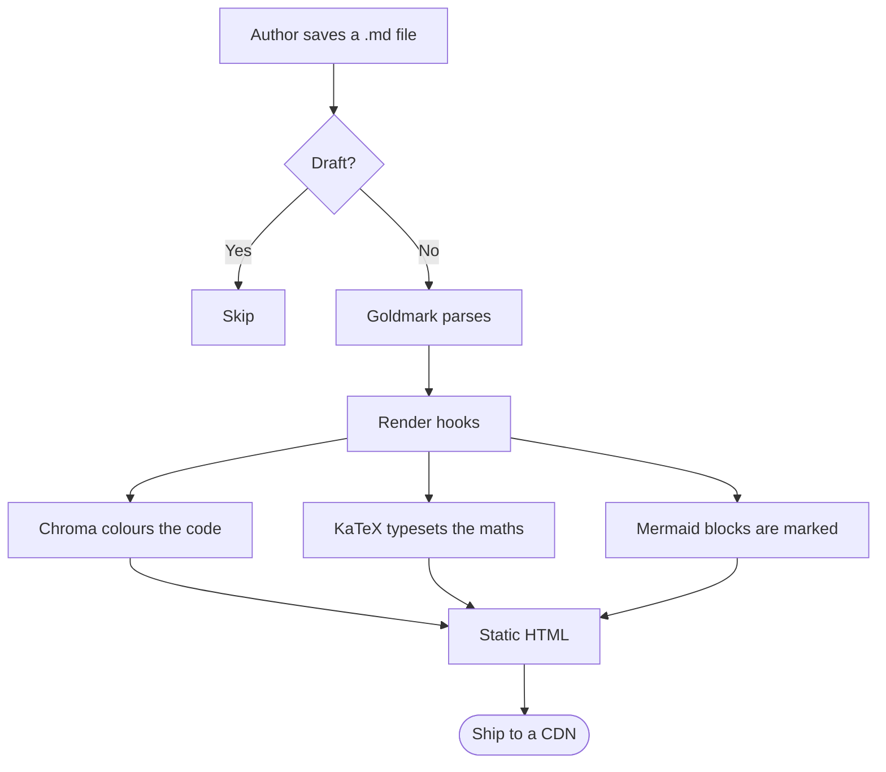
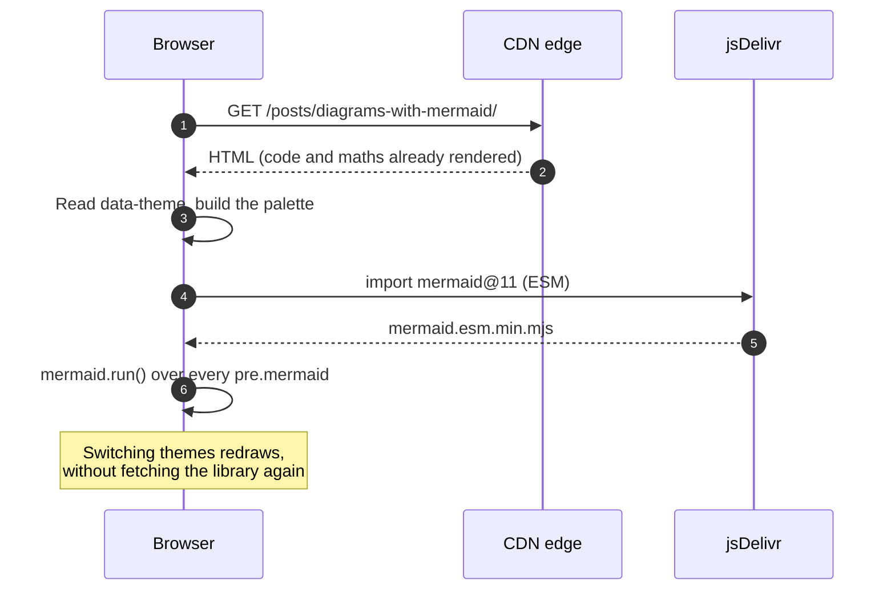
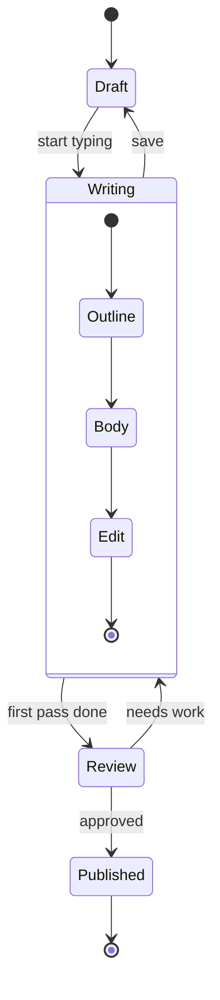
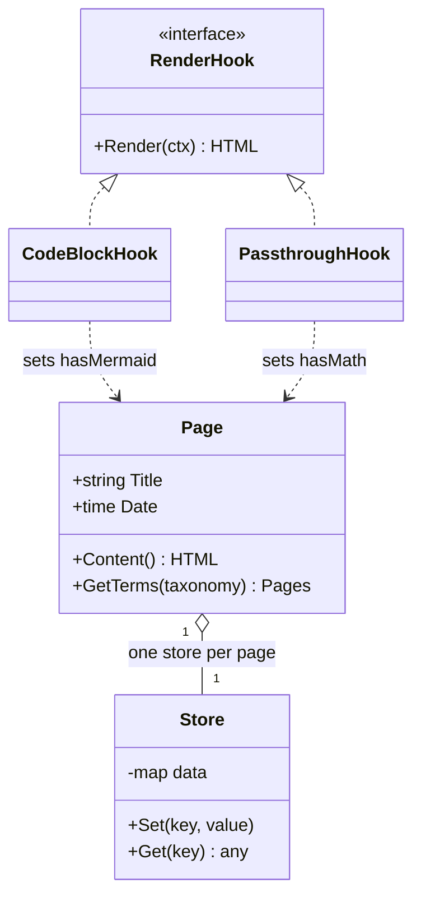
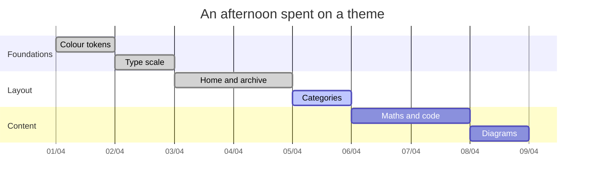

This is the one thing in the theme that genuinely needs JavaScript, and it only
loads on the pages that actually contain a diagram. The palette is read out of
the same CSS variables everything else uses, so a diagram can never drift out of
tone with the page around it.
{.lead}

## Flowchart



## Sequence diagram



## State diagram



## Class diagram



## Gantt chart

Diagrams sit inside the text column like any paragraph. The Gantt chart below
adds `{wide=true}` to its fence, so it bleeds out to the page frame — worth doing
when a chart has many horizontal columns and squeezing it makes it unreadable:



## How it is wired in

A render hook dedicated to the `mermaid` language intercepts the block before
Chroma can touch it, and raises a flag so the end of the page knows to load the
library:

```go-html-template {title="layouts/_default/_markup/render-codeblock-mermaid.html"}
{{- .Page.Store.Set "hasMermaid" true -}}
{{- $wide := .Attributes.wide -}}
<pre class="mermaid{{ if $wide }} is-wide{{ end }}">{{- .Inner | htmlEscape | safeHTML -}}</pre>
```

The awkward part is the palette. The theme's tokens are declared with
`light-dark()`, and `getComputedStyle` hands back a custom property verbatim
rather than resolving it — so the value has to be forced through a hidden element
first:

```javascript {title="assets/js/mermaid-init.js"}
const probe = document.createElement("span");
probe.style.display = "none";
document.body.appendChild(probe);

const c = (name) => {
  probe.style.color = `var(${name})`;
  return getComputedStyle(probe).color;   // -> "rgb(18, 23, 29)"
};

mermaid.initialize({
  theme: "base",
  themeVariables: {
    background: c("--canvas-alt"),
    primaryColor: c("--surface"),
    primaryTextColor: c("--ink"),
    lineColor: c("--ink-3"),
  },
});
```


Press the theme toggle at the top of the page, then scroll back to the diagrams
above. They are redrawn from the original source stashed in `dataset.source` —
this is not CSS recolouring an existing picture.



Mermaid is fetched from jsDelivr, which means your readers' browsers make a
request to a third-party domain. If you would rather they did not, download
`mermaid.esm.min.mjs` into `assets/js/` and point the `import` in
`mermaid-init.js` at the local copy.

