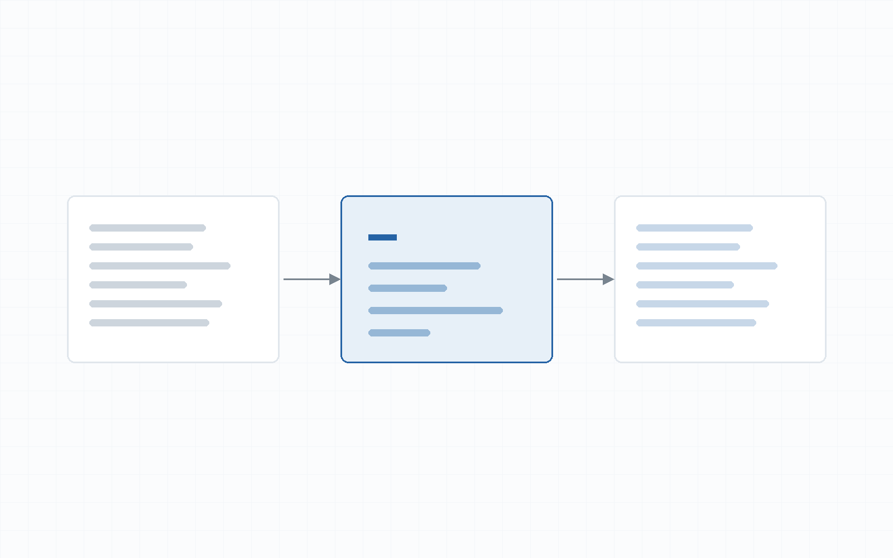

There is no argument on this page. It is a lookup table: what you type on top,
what the theme renders underneath. Open it when you are mid-sentence and have
forgotten a mark.
{.lead}

Hugo uses [Goldmark](https://github.com/yuin/goldmark) as its Markdown renderer.
On top of plain CommonMark, this theme enables tables, footnotes, task lists,
definition lists, highlighting, subscript and superscript, block attributes, raw
HTML and smart punctuation — all of which appear below.

## Headings

```markdown
## Second level
### Third level
#### Fourth level
##### Fifth level
```

The first level is reserved for the post title, so inside the body you start at
the second. Levels two and three go into the table of contents; level four and
below do not. Hover a heading and a `#` appears for grabbing its anchor.

#### This is a fourth level

##### And this is a fifth

## Emphasis

| Type | Get |
| --- | --- |
| `**bold**` | **bold** |
| `*italic*` | *italic* |
| `***bold italic***` | ***bold italic*** |
| `~~struck out~~` | ~~struck out~~ |
| `++inserted++` | ++inserted++ |
| `==highlighted==` | ==highlighted== |
| `H~2~O` | H~2~O |
| `E = mc^2^` | E = mc^2^ |
| `` `inline code` `` | `inline code` |

## Line breaks

A blank line starts a new paragraph. To break a line while staying in the same
paragraph, end it with a `\`:

```markdown
First line\
Second line, same paragraph
```

First line\
Second line, still the same paragraph.

## Lists

### Unordered

```markdown
- First item
- Second item
  - A nested item
  - And another
- Third item
```

- First item
- Second item
  - A nested item
  - And another
- Third item

### Ordered

1. Step one
2. Step two
   1. Step two point one
   2. Step two point two
3. Step three

### Task lists

```markdown
- [x] Done
- [ ] Not done
```

- [x] Build the colour tokens
- [x] Write the code block render hook
- [ ] Self-host the fonts instead of calling a CDN
- [ ] Add a search page

### Definition lists

```markdown
Goldmark
: The Markdown renderer Hugo uses.
```

Goldmark
: The Markdown renderer Hugo uses, written in Go, closely following CommonMark.

Chroma
: The syntax highlighter, also written in Go, running at build time.

Render hook
: A scrap of template that sits between Goldmark and the HTML, letting you decide
  what one kind of element turns into.

## Blockquotes

> Simplicity is prerequisite for reliability.
>
> > A quote nested inside a quote works too.
>
> <cite>Edsger W. Dijkstra</cite>

The `<cite>` element gets its own treatment: pulled out to the margin, prefixed
with a dash, one size smaller and paler.

## Links

| Type | Get |
| --- | --- |
| `[link text](https://gohugo.io/)` | [link text](https://gohugo.io/) |
| `[with a title](https://gohugo.io/ "Shown on hover")` | [with a title](https://gohugo.io/ "Shown on hover") |
| `<https://gohugo.io/>` | <https://gohugo.io/> |
| `[reference style][gh]` | [reference style][gh] |

[gh]: https://github.com/yuin/goldmark

Links leaving the site pick up `rel="noopener noreferrer"` automatically. To link
another post on the site, use the `ref` shortcode: Hugo fails the build if the
target does not exist, so a broken internal link cannot reach production.

```markdown
[the welcome post]()
```

Which gives: [the welcome post]().

## Figures

An image sitting next to `index.md` is referenced by filename alone. The square
brackets become the `alt` text, the quoted string becomes the caption:

```markdown

```


The theme also builds 700px and 1400px WebP versions and attaches a `srcset`,
along with `loading="lazy"` and explicit dimensions so the page does not jump as
the image arrives.

## Tables

```markdown
| Left | Centre | Right |
| :--- | :---: | ---: |
| a | b | 1 |
```

| Feature | On by default | Comes from |
| :--- | :---: | ---: |
| Tables | yes | GFM |
| Footnotes | yes | GFM |
| Task lists | yes | GFM |
| Definition lists | yes | Goldmark |
| Highlight, sub- and superscript | yes | `extras` |
| Block attributes | yes | `parser.attribute` |

A table wider than the screen scrolls on its own rather than dragging the whole
page sideways — and the wrapper is built into the HTML, not added by JavaScript.

## Code blocks

Three backticks and a language name:

````markdown
```go
fmt.Println("hello")
```
````

Add `title` for a filename, `linenos` for a gutter of line numbers, `hl_lines` to
pick out a few:

````markdown
```go {title="main.go",linenos=true,hl_lines=["3-4"]}
```
````

```go {title="main.go",linenos=true,hl_lines=["3-4"]}
package main

func main() {
	println("this line is highlighted")
}
```

Leave the language off and Chroma guesses. To be sure nothing is coloured, say
`text`:

```text
Nothing in this block is coloured.
  Whitespace stays exactly as typed.
```

## Horizontal rules

Three dashes on a line of their own. The theme draws them as three centred dots
rather than a line:

---

## Footnotes

```markdown
A sentence with a note[^a-note].

[^a-note]: The note itself, definable anywhere in the file.
```

Footnotes gather themselves at the bottom, numbered in order of
appearance[^order], with an arrow back to where you were[^back].

[^order]: Numbered by where the reference appears in the text, not by the order
    in which you wrote the definitions.
[^back]: Press the ↩︎ at the end of this line to jump back.

## Raw HTML

The theme sets `unsafe = true`, so HTML written directly in Markdown works:

| Type | Get |
| --- | --- |
| `<kbd>Ctrl</kbd>` | <kbd>Ctrl</kbd> + <kbd>K</kbd> |
| `<abbr title="...">CLI</abbr>` | <abbr title="Command Line Interface">CLI</abbr> |
| `<sup>up</sup>` | x<sup>2</sup> |
| `<sub>down</sub>` | log<sub>2</sub>n |

A `<details>` element folds a long passage away:

<details>
<summary>Why raw HTML is enabled</summary>

Because some things have no Markdown equivalent: `<kbd>`, `<abbr>`, `<details>`,
`<ruby>`, a hand-written `<figure>`. The risk is that you can paste in broken
HTML and break the layout — but this is a personal blog where you write
everything yourself, so the convenience is worth it.

</details>

## Smart punctuation

Goldmark's *typographer* substitutes a few characters during the build:

| Type | Get |
| --- | --- |
| `"double quotes"` | "double quotes" |
| `'single quotes'` | 'single quotes' |
| `--` | -- |
| `---` | --- |
| `...` | ... |

Inside code, nothing is touched: `"still straight"`, `--still-two-dashes`.

## Block attributes

Braces on the line directly below a block attach a class or an id:

```markdown
The opening paragraph, set larger and paler.
{.lead}

## A heading with its own id
{#my-own-id}
```

Figures take `{.wide}` to bleed out of the text column, the same way a code block
takes `wide=true`.

## Emoji

The sample site enables `enableEmoji`, so `:rocket:` becomes :rocket:,
`:sparkles:` becomes :sparkles:, and `:vietnam:` becomes :vietnam:.

## Escaping

Put a `\` in front of a character to stop it being read as syntax: `\*not
italic\*` gives \*not italic\*, and `\_no_word_breaks\_` gives \_no_word_breaks\_.

## Shortcodes

Beyond Markdown, the theme adds a `callout` shortcode:

```markdown

The body is ordinary Markdown.

```


`type` accepts `note`, `tip`, `warning` and `danger`. They differ only in the
colour of the left rule and of the title.



This is the `danger` variant — save it for things that genuinely break, not for
every passing remark, or readers will learn to ignore it.


There are two more, `ruby` and `kenten`, both for Japanese; see
[writing in Japanese]().

## Wide code blocks

Code sits inside the text column by default. Add `wide=true` to let it reach the
edge of the page frame, exactly the width diagrams and wide figures use:

````markdown
```go {title="wide.go",wide=true}
```
````

```go {title="wide.go",wide=true}
// This block is wider than the text column. Use it when the lines are long and
// you would rather the reader did not have to scroll.
func CalculateWithARatherLongFunctionName(firstArg, secondArg, thirdArg int) (int, error) {
	return firstArg + secondArg + thirdArg, nil
}
```

## Two more things

Mathematics and diagrams have posts of their own, because both need extra
configuration: see [mathematics with LaTeX]()
and [diagrams with Mermaid]().
